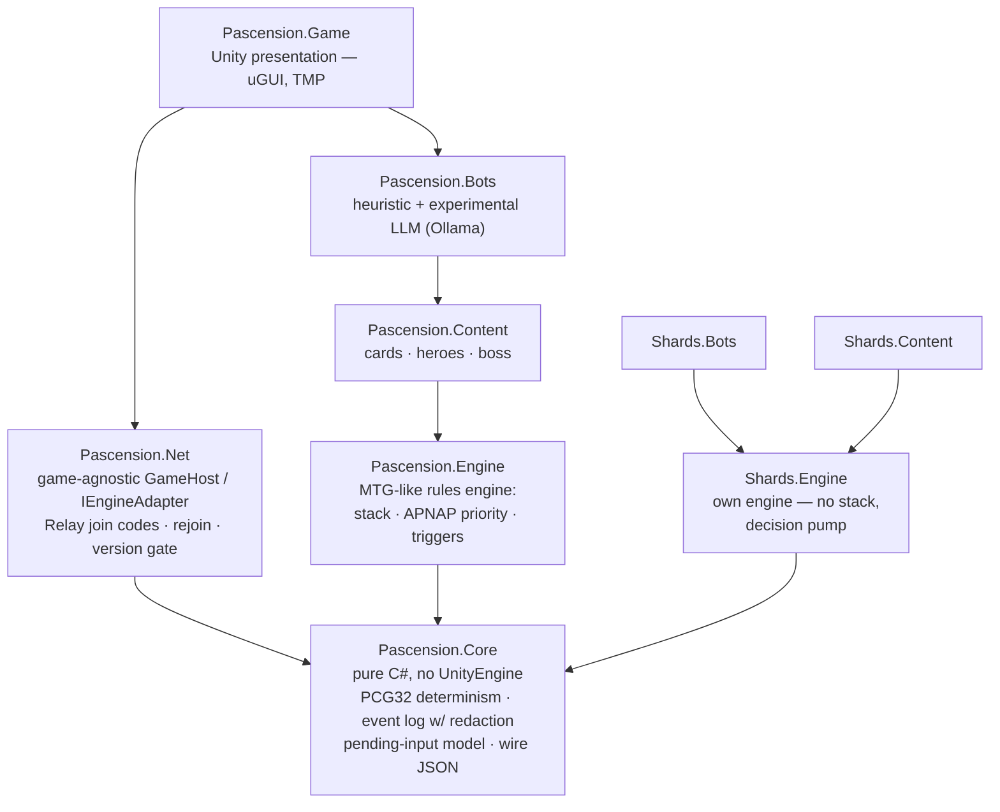

# Pascension

*A competitive deck-building race game with a full MTG-like rules engine — and a working example of running a real game project end-to-end with AI-assisted development.*

[](https://github.com/Shirakawa42/Pascension/actions/workflows/release.yml)
[](https://github.com/Shirakawa42/Pascension/releases/latest)
[](https://unity.com)


<!-- HERO SHOT: docs/media/hero.png — Pascension table mid-game, 1920x1080. Captured via Unity MCP. Uncomment when committed. -->
<!-- <p align="center"></p> -->

## Overview

Pascension is a 2-4 player competitive deck-builder: buy cards Ascension-style from a shared market, race up a 50-step board, level your hero from 1 to 10, and burst down the boss when you reach step 50. Play solo against bots or online with a join code. Under the hood is a full MTG-like rules engine — a stack, APNAP priority, instant-speed responses, and triggered abilities.

Why this repo might interest you:

- A **game-agnostic deterministic core** with an MTG-grade rules engine on top — proven by hosting a second, completely different game on the same substrate → [Architecture](#architecture)
- **129 engine tests that run without Unity** — `dotnet test` is the whole inner loop → [Determinism & testing](#determinism--testing)
- Built end-to-end with **AI-assisted development** — plan-first workflow, living skill files, MCP-driven live verification, deterministic AI art → [AI-assisted development](#ai-assisted-development)

## The games

### Pascension

The original game. 2-4 players buy from a shared card market (three tiers gated by hero level), race a 50-step board with inn checkpoints, and win by killing The Gatekeeper on the final step. Every play is respondable: instants, counterspells, and damage-denial effects resolve on a real stack with Arena-style auto-pass priority. Online play is host-based over Unity Relay — share a join code, no port forwarding, no dedicated server — with pause-on-disconnect, mid-game rejoin, and host-controlled bot takeover.

<!-- <p align="center"></p> -->

### Shards of Infinity (fan re-implementation)

A second, complete game built on the same `Pascension.Core` substrate — which is the point: it proves the core is genuinely game-agnostic. It has its own engine (no stack — a single-pending-input decision pump), its own card database, bots, and table UI built on the shared presentation stack.

<!-- <p align="center"></p> -->

> **Fan project disclaimer.** *Shards of Infinity* is a published card game designed by Justin Gary and Gary Arant. The implementation here is an **unofficial, non-commercial fan project**, built as a personal engineering exercise. It is not affiliated with, endorsed by, or sponsored by the game's designers, publisher, or any rights holder, and all related trademarks remain the property of their respective owners.
>
> No official assets are included in this repository: all rules text is functionally paraphrased rather than copied, and every image is original AI-generated artwork made for this project. (An optional local editor tool can fetch official card art for *personal use on your own machine*; its output is gitignored and is never committed or distributed.) Public release builds are compiled with `PUBLIC_RELEASE=true`, which **strips all Shards of Infinity content from distributed binaries** — the downloadable builds contain Pascension only.
>
> If you enjoy it, buy the official game.

## Features

- Full rules engine: stack, APNAP priority, instant-speed responses, triggered/activated/continuous abilities
- Deterministic simulation core: seeded PCG32 RNG, append-only event log with per-player redaction, single-pending-input model, whitelisted JSON wire format
- Online play: Unity Relay join codes, host mode, pause-on-disconnect, mid-game rejoin, kick-to-bot, version gate on connect
- Speculative fast-play: queue plays as fast as you like; effects apply and reveal only once validated, with automatic rollback if an opponent responds
- Bots: heuristic AI opponents, plus an experimental LLM-driven bot (local Ollama)
- Self-updating desktop builds (Windows + macOS) with sha256-verified downloads
- French display localization (official IELLO terminology for the Shards of Infinity content)
- 129 headless NUnit tests runnable with nothing but the .NET 8 SDK

## Architecture

Strict layering with a Unity-free bottom half: everything below the Unity line compiles and runs under `dotnet test` on net8.0 (a hand-authored project mirrors the Unity asmdefs). The same `Pascension.Core` substrate hosts two complete games, and the networking layer (`GameHost` / `IEngineAdapter`) is game-agnostic — it talks to the core contracts, not to either game. Roughly ~200 C# files / ~32k lines of game code.



Everything except `Game` and `Net` is Unity-free (`noEngineReferences` asmdefs) — the rules never touch UnityEngine.

## Determinism & testing

The core is deterministic by construction: a seeded PCG32 RNG, an append-only event log that fully describes a game (redacted per player for hidden information), and a single-pending-input model — so any game can be re-simulated headlessly and the same seed plus the same action sequence always reproduces the same state hash.

The engine suite lives in [`Tools/EngineVerify`](Tools/EngineVerify) as a net8.0 project that mirrors the Unity asmdefs: `dotnet test` runs all **129 tests in about a second, with no Unity installed** — and that is exactly what CI runs. The suite includes golden wire-format fixtures (serialization can't drift silently), pinned FAQ-ruling tests for card edge cases, and bot-vs-bot simulation soaks that play entire games and assert termination and card-conservation invariants. The identical tests also run inside the Unity Test Runner.

## CI/CD & self-update

- **Fast gate** ([`tests.yml`](.github/workflows/tests.yml)): PRs and branches run the headless engine suite with a sparse checkout that skips ~260 MB of art — feedback in 1-2 minutes.
- **Release** ([`release.yml`](.github/workflows/release.yml)): every push to `main` runs the test gate, then a [GameCI](https://game.ci) `unity-builder` matrix produces a Windows zip and a macOS `.app` tar.gz (ad-hoc signed with `rcodesign` for Apple Silicon). The GitHub Release `v1.0.<run>` is created as a **draft and published only after every asset is uploaded**, so the updater can never observe a half-published release. Each release ships a `latest.json` manifest (version, per-platform url/sha256/size).
- **In-game self-update**: the main menu shows the current version and an UPDATE button when a newer release exists. The updater downloads, verifies the sha256 against a freshly-fetched manifest, and relaunches via a swap script (robocopy on Windows, mv-with-rollback on macOS).
- **Version gate**: multiplayer connections are rejected at approval time on any version mismatch, so mismatched builds can't join each other.

Every push to main ships a release — the [Releases page](https://github.com/Shirakawa42/Pascension/releases) is the changelog.

## AI-assisted development

This project is a deliberate experiment in running a non-trivial game project with an AI pair the whole way — not "AI wrote some code", but a repeatable process with guardrails:

- **Plan-first workflow.** Features start as written plan files that get reviewed before any code changes. Claude Code executes against the plan; the plan is the contract.
- **Skills as living documentation.** [`.claude/skills/`](.claude/skills) holds project-specific skill files — the rules-engine internals, the card registries, networking gotchas, the art pipeline, the playtesting harness — split cleanly per game plus shared infrastructure. The card registries are *mandatory-update*: any card change must update its registry entry in the same commit, so the machine-readable project knowledge can't rot.
- **Headless verification loop.** Because the engine runs without Unity, every change is verified by running the full 129-test suite with plain `dotnet test` — no editor round-trip in the inner loop.
- **Live UI verification over MCP.** A Unity MCP server ([CoplayDev/unity-mcp](https://github.com/CoplayDev/unity-mcp)) lets the agent drive the *actual running game* — click through real menus, submit real plays, take mid-animation screenshots. Multiplayer was battery-tested over real Unity Relay using a purpose-built auto-joining client build (join by code, kill-process disconnects, rejoin, kick-to-bot).
- **Deterministic AI art pipeline.** Every card image is generated locally with ComfyUI + the Anima model. Each card definition carries an `ArtPrompt`, and the generation seed is a hash of the card id — art is reproducible, and regenerating a card yields the same image unless its prompt changed.
- **Codebase knowledge graph.** The C# codebase is indexed into a queryable knowledge graph (graphify), so agent sessions answer "where/what" questions from the graph instead of re-reading files — cutting token cost and onboarding time.
- **Experiments.** One bot delegates its in-game decisions to a local LLM via Ollama (experimental, fallback-guarded so it can never stall a game).

## Getting started

### Play (no Unity required)

Grab the latest build from [Releases](https://github.com/Shirakawa42/Pascension/releases/latest):

- **Windows**: unzip, run `pascension.exe`.
- **macOS**: untar, right-click → Open the first time (the app is ad-hoc signed, not notarized). Note: macOS builds are produced by CI but have not yet been tested on physical Apple hardware — reports welcome.

Builds check for updates on launch and can self-update from the main menu.

### Run the engine tests (only the .NET 8 SDK needed)

```
cd Tools/EngineVerify
dotnet test
```

129 tests: rules-engine behavior, FAQ-ruling pins, golden wire-format fixtures, bot-vs-bot simulation soaks.

### Open in Unity

Unity **6000.3.7f1** (URP 2D). Open the project, load `Assets/Scenes/MainMenu.unity`, press Play. Solo vs bots works out of the box; online host mode requires linking the project to a Unity Services account with Relay enabled.

## Project structure

```
Assets/
  Scripts/
    Core/      # Pascension.Core — pure C# deterministic sim substrate (incl. updater logic)
    Engine/    # Pascension.Engine — rules engine (stack, priority, effects, triggers)
    Content/   # Card/hero definitions + per-card ArtPrompts
    Bots/      # Heuristic bots + experimental Ollama LLM bot
    Net/       # NGO 2.x + Relay: GameHost, IEngineAdapter, rejoin, version gate
    Game/      # Unity presentation (uGUI, TextMeshPro, runtime-built UI — no prefabs)
    Shards/    # Shards.Engine / .Content / .Bots — fan project, same Core
    Editor/    # Editor tooling (art pipeline, CI build entry, scene builders)
  Art/         # Generated original art (cards, heroes, board)
  Scenes/      # MainMenu, Lobby, Game, GameShards
  Tests/       # The NUnit suite (also compiled headless by EngineVerify)
Tools/
  EngineVerify/  # net8.0 test harness — `dotnet test`, no Unity; golden/ wire fixtures
  ShardsData/    # SoI functional rules research + generated card table
.claude/skills/  # Project skills: per-area living documentation for AI-assisted work
.github/workflows/  # tests.yml (fast PR gate) · release.yml (build → release → updater manifest)
```

## Tech stack

| Area | Tech |
|---|---|
| Engine | Unity 6000.3.7f1, URP (2D) |
| UI | uGUI, TextMeshPro, LitMotion, runtime-built (no prefabs) |
| Input | Unity Input System |
| Networking | Netcode for GameObjects 2.13, Unity Relay + Authentication (join codes, host mode) |
| Serialization | Newtonsoft Json.NET (whitelisted polymorphic wire format) |
| Testing | NUnit — 129 headless tests on .NET 8 (`Tools/EngineVerify`), Unity Test Runner, Multiplayer Play Mode |
| CI/CD | GitHub Actions, GameCI unity-builder, rcodesign (macOS ad-hoc signing), self-updating releases |
| AI tooling | Claude Code + project skills, [unity-mcp](https://github.com/CoplayDev/unity-mcp), ComfyUI + Anima (art), Ollama (experimental bot), graphify (code knowledge graph) |

## Roadmap

- Shards of Infinity online: run the Relay multiplayer battery against the SoI table
- Balance: large-scale bot-vs-bot simulation sweeps (XP curve, card costs, boss HP)
- Audio: music + SFX pass

## Status & contributing

Personal project, actively developed. Issues and questions are welcome; PRs by prior discussion.
