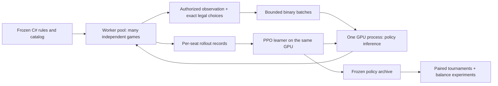

# Fresh Shards AI investigation — 2026-09-25

**Recommendation:** build a compact, masked self-play PPO agent around the current headless C# engine, retaining exact card identities/counts and strategic actions. Batch many games through one GPU learner/inference process. Omit expensive belief tracking and long history initially, then test whether those omissions matter. Use a small policy population and controlled experiments to produce balance evidence.

This recommendation is a starting hypothesis for a timed experiment, not a claim that PPO is provably best or that 12 hours can solve this game. The investigation used current rules/content, new probes, official documentation and primary research. It did not inspect or reuse the deleted AI, old weights, old training data, old performance results, or Git history.

The original deliverable was the investigation and a reproducible CPU probe; that investigation did not change production game files. At that stage no trainer or neural policy had been built and no GPU learning throughput had been measured. The follow-up rule decisions and corrections below supersede the original audit's open questions. Subsequent bounded simulator, GPU and pipeline experiments now live in [TrainingPreflight](../TrainingPreflight/README.md); their disposable optimizer probes are not a launched training campaign or evidence of playing strength.

## Evidence and supporting reports

| Artifact | What it establishes |
| --- | --- |
| [Rules and content audit](rules-and-content-2026-09-25.md) | Actual all-DLC rules, official/custom distinctions, strategic mechanics, data authority and correctness questions |
| [Algorithm research](algorithm-research-2026-09-25.md) | Primary-source algorithm comparison, observation/action design, learning contract, strength evaluation and causal balance methodology |
| [RTX 5090 systems research](rtx5090-systems-2026-09-25.md) | CPU/GPU pipeline, Blackwell compatibility, batching, precision, compilation, memory and measurement gates |
| [CPU measurements](engine-probe-2026-09-25.json) | Fresh exercise workload, source fingerprint, allocation and throughput results; no neural work |
| [Longer CPU measurements](engine-probe-sustained-2026-09-25.json) | Repeated 50,000-game runs to check the short parallel timing result |
| [Original boundary audit results](observation-audit-2026-09-25.json) | Pre-fix hidden-hand glow leakage and Comet acquisition path; the confirmed, intended Allegiance treatment of temporary cards |
| [Corrected boundary audit results](observation-audit-fixed-2026-09-25.json) | Current regression checks for opponent glow privacy, intended Allegiance counting and blocked Comet acquisition through Shard Defiant |
| [Probe source](EngineProbe/Program.cs), [boundary fixtures](EngineProbe/ObservationAudit.cs) | Reproduction using the actual engine; no training or strength claims |

The original investigation's headless suite passed **208 tests**, excluding the two file-export test names to avoid regenerating unrelated user files. This historical result predates the follow-up fixes and their regression tests; the original boundary fixtures exposed behaviors not prevented by that suite.

After the follow-up fixes, **225 headless tests passed** (excluding only `ExportArtManifest`, including the card-table exporter), and **23 Card Designer smoke checks passed**. The corrected boundary audit also passes. Live Unity UI verification was unavailable because the editor bridge was not running.

## Precisely which game to train

The target is the repository's **two-player, all-DLC Duel of Doom ruleset**, not an unspecified tabletop edition. `ShardsDlc.Duel` normalizes to all four flags (`15`): Relics of the Future, competitive Shadow of Salvation, Into the Horizon and custom Duel. The cooperative campaign and other formats are separate games and should not consume this experiment's capacity. [Configuration and normalization](../../Assets/Scripts/Shards/Engine/ShardsEngine.cs), [content registry](../../Assets/Scripts/Shards/Content/ShardsContentRegistry.cs).

Duel has five heroes. Seat 1 drafts first, seat 0 second, without duplicate heroes, after the initial board and hands exist. Each hero has three associated relics in Duel; acquiring the normal relic at mastery 10 is a strategic choice. Destinies are available from the shared row at mastery 5. Hero abilities, escalating market rerolls, replacement cards, Ingeminex, Allegiance and altered Dominion materially change the game. Train and evaluate the legal draft, not only preselected hero pairs. [Detailed inventory and mechanics](rules-and-content-2026-09-25.md).

The **current executable C# catalog** governs simulated behavior. The CardDesigner JSON is design intent; generated card tables and historical prose can be stale. Freeze a content hash plus explicit rule decisions before the expensive run. Do not silently substitute current Saga rules for this implementation or mix reports from different DLC masks.

Important strategic tensions to leave learnable:

| Tension | Why a shortcut can distort the resulting meta |
| --- | --- |
| Spend gems on economy, focus, hero ability or reroll | They compete for the same resource; mastery unlocks nonlinear card/relic/destiny effects |
| Buy permanently versus fast-play now | Immediate tempo, future deck dilution, faction triggers and market return interact |
| Thin a deck versus retain faction density | Banish improves draw quality but can weaken Allegiance and other composition requirements |
| Damage race versus mastery/Infinity versus Comet | Different clocks can punish different defensive or economic plans |
| Deploy/activate champions versus deny the opponent | Persistent engines, shield protection and taunt make combat allocation meaningful |
| Reveal, reorder and refill the market | Information has value; acquisitions/rerolls can reveal Ingeminex and change rewards/risks |
| Commit to a relic/destiny versus wait | Availability changes, and synergies depend on board, deck and opposing strategy |

These are mechanic-derived hypotheses for exploration, not findings that any strategy is currently strongest.

## Resolved rules from the original boundary audit

The original `audit` command created isolated synthetic states and reproduced the behaviors below. Its [saved results](observation-audit-2026-09-25.json) remain historical evidence, not a description of the corrected engine. These fixtures do not estimate how often a situation arises naturally. The user has now resolved all three interpretations.

1. **Opponent condition glows must not reveal hidden information.** The original audit changed a ready opposing Aegis Archivist from unlit to lit by swapping three crystals in its hand with three faction cards in its hidden deck. The total collection, public counts and every other serialized snapshot field stayed identical. The user confirmed this is a bug. The corrected snapshot evaluates conditional hints only for the viewer's own cards and market choices; opponent champions and destinies do not receive those hints. Keep regression checks for hidden-state permutations, and derive any training predicates only from authorized inputs. [Snapshot builder](../../Assets/Scripts/Shards/Engine/ShardsSnapshot.cs), [conditional effects](../../Assets/Scripts/Shards/Engine/ShardsEffects.cs).
2. **Allegiance intentionally counts temporary fast-played cards.** A fast-played Nil Assassin contributes one Wraethe card to `AllegianceEffect.OwnedCount`, while `FullDeck` excludes the temporary card. The user confirmed this is normal behavior, not a bug. Preserve both meanings; an Allegiance feature must include eligible temporary cards in play instead of relying on permanent owned-deck counts alone. [Duel effects](../../Assets/Scripts/Shards/Engine/ShardsDuelEffects.cs).
3. **Comet must be acquired through a normal purchase.** The original audit showed Shard Defiant's 2-gem activation revealing Comet and its Keep choice recruiting the cost-13 card to discard. The user confirmed this is a bug: paid destiny activation does not satisfy Comet's purchase requirement. Free recruitment now rejects Comet. Shard Defiant still reveals it, but Keep is disabled and Banish is the legal default. Its normal market purchase remains available under the usual effective-cost rules. [Shard Defiant](../../Assets/Scripts/Shards/Content/ShardsHorizonSet.cs), [Comet](../../Assets/Scripts/Shards/Content/ShardsDuelSet.cs), [recruitment](../../Assets/Scripts/Shards/Engine/ShardsEngine.cs).

Train and evaluate these resolved semantics. Freeze a new rules/content fingerprint after the fixes; the historical audit and benchmark fingerprints describe the pre-fix engine.

## What the original CPU experiment measures

The timings and corpus counts below are preserved measurements of the pre-fix engine. They are an optimization baseline, not a benchmark of the corrected rules.

The user confirmed this computer is the training host. It reports an RTX 5090 with 32,607 MiB VRAM, driver 616.56, Ryzen 7 5800X (8 cores / 16 threads), and about 43 GiB RAM visible to Ubuntu 24.04 under WSL2. A Windows CIM query reports 85,780,729,856 bytes of physical memory (about 79.9 GiB usable on the host); size the initial pipeline against WSL's smaller visible allocation. .NET SDK 8.0.423 is installed at `/home/lva/.dotnet/dotnet`; the inspected Python environment has no PyTorch, NumPy or JAX.

The probe compiles current Core + Shards engine/content into a fresh Release console application. It uses a deliberately simple action schedule with random choices within categories, random eligible decision subsets, and engine defaults for damage assignment. It never evaluates hidden cards to pick actions. It includes setup, normal event retention, legal action generation, rule resolution, per-game counters and a final state hash. The optional `snapshot` mode also builds a player snapshot before every submitted action. There is no rendering, transport, feature encoder, policy inference, learning or full balance telemetry.

The initial paired corpus is 2,000 seeds, each replayed under every measured mode/worker setting, with 32 excluded warm-up games. The corpus contains 668,268 submissions, approximately 334 per game and 12.08 rounds/game, 87,365 decision answers and 13,957 inputs owned by someone other than the turn player. No game hit the 20,000-action / 400-round administrative guard. Maximum observed ordinary menu size was 36, decision options 49, hand size 13, split power 344. These are **observed maxima, not safe tensor capacities**. [Raw results](engine-probe-2026-09-25.json).

| Workers | Work per decision | Median submissions/s | Range over three runs | Allocated bytes/submission |
| ---: | --- | ---: | ---: | ---: |
| 1 | Engine + exercise driver | 353,242 | 347,749–372,156 | 1,533 |
| 4 | Engine + exercise driver | 912,490 | 765,643–940,868 | 1,533 |
| 8 | Engine + exercise driver | 1,148,555 | 956,714–1,449,083 | 1,533 |
| 1 | Above + presentation snapshot | 8,944 | 8,933–9,078 | 186,224 |
| 4 | Above + presentation snapshot | 25,911 | 24,919–26,506 | 186,224 |
| 8 | Above + presentation snapshot | 31,317 | 30,635–32,400 | 186,224 |

All eighteen runs had the same final-state fingerprint, outcomes and action count. The single-worker snapshot workload is about **39.5 times slower**, with about **121 times the managed allocation**. These ratios apply to this particular workload. Parallel bare-engine cases lasted less than a second and had substantial variability, so the separate longer-run result is the better estimate of repeatability; neither estimates training throughput.

The longer follow-up used **50,000 unique seeds**, repeated three times with eight workers. Each run completed all games without a rejected action or administrative cap, with 16,488,812 submissions and the same final fingerprint. Median throughput was **2,707,669 submissions/s**, range **2,683,474–2,740,186/s**, over 6.02–6.14 seconds per run. Allocation stayed about 1,533 bytes/submission. The longer duration materially changes the result, consistent with warm-up/tiered-runtime effects; their contribution was not isolated. This is still not a long-duration learner or resident-game memory test. The larger corpus reached 38 ordinary menu entries, reinforcing that earlier maxima are not bounds. [Longer results](engine-probe-sustained-2026-09-25.json).

The simple driver is not representative of trained play: it prioritizes hand plays, ignores nuanced combat, often avoids useful optional effects and does not deliberately construct long combos. Multiple repeats reuse the same seeds, so they are performance repetitions, not additional independent games. The concurrency probe finishes one game per worker; it does not measure the working set of thousands of games waiting for neural inference. Final-state fingerprint equality is a useful regression check, but the engine hash does not cover every latent field or iterator continuation. Branch counts include concession; option counts do not enumerate combinatorial subsets/orders/allocations. The JSON's `gamesPerSecond` counts attempts, so consult `completed` and `capped` separately on new workloads. GC collection counts extend through small post-timing aggregation; allocation deltas cover synchronous per-game work only, not the outer scheduler.

The snapshot comparison isolates a practical optimization opportunity: avoid reconstructing the entire presentation object graph at every training decision. `InitialCardCounts` also repeatedly reconstructs replacement/relic metadata; its exact contribution still needs component profiling. Cache frozen setup metadata and encode directly into compact numeric buffers. Event logging and legal-action allocation should be profiled after this; do not assume the rules themselves need a rewrite. [Snapshot construction](../../Assets/Scripts/Shards/Engine/ShardsSnapshot.cs), [setup metadata](../../Assets/Scripts/Shards/Engine/ShardsEngine.cs).

## Recommended new training architecture



**Simulator:** retain the C# engine as the rules authority. Initially use one process, a measured worker pool and multiple resident games per worker; a game has one owner at a time. The current private iterator/effect queue makes arbitrary state cloning nontrivial. Use deterministic replay from seed plus action trace for debugging; do not treat a visible-state copy as a resumable search node. [Engine implementation](../../Assets/Scripts/Shards/Engine/ShardsEngine.cs).

**Observation:** small arrays of card-definition counts, board entities, effective costs/defenses, resources, turn/game flags and the full pending choice. Keep own deck composition, own hand, public zones and concise public memory. Encode temporarily revealed top cards when known; never expose true hidden order, true opposing hand or RNG state. Maintain definition IDs independently of raw global instance IDs. Audit masks and candidate ordering for leaks too. Presentation snapshots omit necessary flags and source/context and therefore cannot serve as the complete RL interface.

**Policy:** start with a pooled entity encoder or MLP, a shared state trunk, a candidate-scoring head and scalar value head. Widths 256/512 and roughly low-million parameter sizes are pilot candidates, not established optima. No text model or artwork encoder is needed. Card IDs plus static numeric/mechanic attributes preserve unusual card behavior without natural-language reasoning at inference time.

**Actions:** score the engine's ordinary legal actions; retain play ordering, end turn, focus timing, reroll, hero ability, buy versus fast-play and delayed relic/destiny acquisition. Factor multi-select and ordered choices into masked subchoices, then submit one complete answer. Represent combat with target/amount choices including overkill: Testudo applies shields to each champion and surviving taunt can block the rest of an attack. An exact-defense-only action set would bias this matchup. Keep an overflow path for unusually large states.

**Learning:** terminal win/draw/loss reward; start with undiscounted episodic utility (`gamma=1`) and correct administrative truncations. A learning seat's trajectory goes to that seat's next decision, including intervening opponent actions; frozen-opponent actions are not on-policy learner samples. Never flip value sign simply on every engine step. Preserve behavior-policy versions and masks for PPO updates. Start mostly with current-policy self-play, retain diverse snapshots and allocate a small share to challenging archived opponents. This population is an engineering heuristic, not an equilibrium guarantee.

**GPU path:** one CUDA owner, inference batches and learner minibatches, bounded queues, reusable buffers, FP32 reference then BF16 dense layers with sensitive probability/loss arithmetic in FP32. Test eager versus compiled execution and a few padded shapes; keep actor and learner weights distinct during updates. Measure all transfers/sampling, not just matrix operations. Benchmark small CPU inference too. Current Blackwell package support and WSL constraints are documented in the [systems report](rtx5090-systems-2026-09-25.md).

**Optimization target:** held-out strength per wall-clock hour, with enough diverse games to support balance analysis. GPU utilization is diagnostic. Increasing model size, epochs or search solely to reach 100% utilization can reduce final strength.

The recommended PPO baseline has primary-source support in both the original method and a large 2026 imperfect-information comparison. Neither tested Shards. DouZero-style terminal Monte Carlo value learning is a worthwhile timed challenger if the shared adapter makes it cheap; its original success required days on four GPUs and does not establish a 12-hour Shards result. [PPO](https://arxiv.org/abs/1707.06347), [2026 comparison](https://proceedings.iclr.cc/paper_files/paper/2026/hash/fe1c4991d57f37dfef62d01b3901ca54-Abstract-Conference.html), [DouZero](https://proceedings.mlr.press/v139/zha21a.html).

## How much information to discard

The best first simplification is **compact current information plus small public memory**, without exact hidden-state belief distributions or a full recurrent history model. A hand/deck count representation is expected to retain much of the economically useful information cheaply; that remains an ablation hypothesis. It should also keep source/context and known reveal information relevant to current choices.

Do not confuse information compression with removing strategy. Automatically playing every card, always focusing, hardcoding shields, or preventing overkill can change which cards look good. Even simple cards can participate in timing and banish choices. Only collapse forced choices or proven-equivalent duplicate choices initially.

Test one or two high-value alternatives at equal time: count encoder versus count encoder plus short memory; compact PPO versus an already working Monte Carlo learner. Track card/hero ranking stability as well as win rate. If a smaller observation wins faster but produces different rankings under a richer audit opponent, label those balance conclusions uncertain.

## Twelve hours of training on this computer

The user clarified that **training has a 12-hour budget; evaluation and balance-data generation can run longer afterward**. Research, implementation, correctness checks and profiling/warm-up happen beforehand. Record preflight compute separately. Keep all learning, including discarded pilots and targeted challenger training, within the twelve hours.

| Elapsed time | Work |
| --- | --- |
| Before the clock | Real pipeline warm-up, numerical/masking/ownership checks and performance smoke run |
| 0:00–1:00 | At most two short matched learning pilots; retain usable checkpoints |
| 1:00–11:00 | Continue the best viable learner; occasional small fixed-opponent checks and archive checkpoints |
| 11:00–12:00 | Targeted challenger continuation against the frozen leader or archive; retain useful responses |
| After training | Larger frozen tournaments, coverage audit, data generation and prioritized balance interventions |

Stop early for invalid actions, leaks, numerical failure or growing unexplained truncation; save evidence instead of burning the reservation. A short pilot can reject clear failures, not reliably rank eventual convergence. Small inline evaluations and checkpoint pauses count conservatively inside the twelve-hour wall-clock schedule; the substantial independent tournament runs afterward. A challenger that does not improve average strength can still reveal a counterstrategy worth preserving.

At **measured end-to-end learner decision rate** `R`, averaged across the whole main block including inline evaluation/checkpoint pauses, ten hours contains `36,000 R` learning decisions. For illustration, 5,000/s yields 180 million and 10,000/s yields 360 million. These are arithmetic scenarios, not forecasts from the CPU benchmark. Repeated PPO epochs, opponent-only choices and wrapper substeps must be counted separately.

## What credible balance data requires

Collect compact per-match and per-opportunity records under frozen policy/configuration hashes. Log whether a card was seen, affordable, chosen, fast-played, played, activated, banished and useful in its actual context. Capture draft order, hero pairing, relic/destiny, mastery bands, economic state, remaining turns, alternative choices and policy probability. Preserve action traces for failures and a sample of normal games. Existing gameplay statistics can inform field names, but acquisition totals alone are insufficient. [Current record types](../../Assets/Scripts/Shards/Stats/SoiSeatRecord.cs).

Keep training seeds, online model-selection seeds and final-audit seeds separate. Select policies on the model-selection set, then report the untouched final-audit set. The larger post-training evaluation can compare many frozen checkpoints and populations without spending more learning time.

Use three separate products:

1. **Observed strategy report:** payoff matrix of frozen policies, seat advantage, natural hero draft, archetypes, combinations, counterstrategies and uncertainty. A population mixture describes only the tested population.
2. **Card/hero opportunity report:** pick and outcome signals conditional on eligibility, matchup, stage and policy, with exposure counts. Never label a card weak merely because it was rarely bought or encountered.
3. **Intervention report:** randomize an eligible choice against a specified alternative, or compare one rule revision with matched seed blocks and frozen policies. Then distinguish immediate impact from impact after agents adapt to the revision.

Raw purchase-associated win rate is confounded by existing advantage and selection. A learned best response finding an exploit establishes weakness; failing to find one does not certify low exploitability. Millions of games from one trained policy do not remove uncertainty about alternative strategies or training seeds. The [algorithm report](algorithm-research-2026-09-25.md) gives primary statistical references and experiment details.

For scale, a simple independent binary outcome near 50% needs about 9,604 games for an approximate 95% interval half-width of one percentage point **per comparison**. Paired games, draws, repeated states, rare cards and many simultaneous comparisons require appropriate grouped intervals and confirmation. Five distinct heroes give 20 ordered non-mirror seat assignments; evaluating natural draft and controlled hero choices are different experiments. Pair seeds and swap policy seats, but remember policy actions consume the game's RNG differently.

Success means an improving, tested population and a prioritized list of balance hypotheses; this is an acceptance criterion, not a promised outcome. The separate evaluation allowance is valuable: run an initial broad coverage campaign, then allocate additional games to uncertain matchups and rare eligible card opportunities. At an illustrative frozen-policy rate of 10,000 engine decisions/s and 334 decisions/game, 100,000 games would take about 56 minutes and one million about 9.3 hours; real policy inference, longer expert games and logging must be measured before scheduling. These are arithmetic examples, not observed neural performance.

Establishing the meta after proposed nerfs/buffs requires additional adaptation runs; that is more training and needs a new allocation. A long frozen-policy evaluation cannot replace it.

## Implementation order and acceptance gates

1. Verify the resolved hidden-information and Comet restrictions, preserve the intended temporary-card Allegiance behavior, and freeze the corrected card/rules manifest with its regression fixtures.
2. Build a dedicated authorized-information observation contract and exact action/decision adapter. Test hidden-state permutations, input-owner changes, Testudo/taunt, extra turns, optional/ordered choices and overflow behavior.
3. Add batched binary transport and compact episode/opportunity telemetry. Profile engine, encoding, transport, inference and learning separately, then together on actual DLC states.
4. Implement compact PPO with terminal rewards, checkpoint archive, deterministic seeds and budget-aware checkpointing. Verify tactical competence and improvement in a short run.
5. Run the strict timed experiment and freeze independent evaluation outputs. Report rules hash, sample/coverage counts, match uncertainty, training-seed limitations and remaining exploitable tactics.

Do not start by rewriting all rules in CUDA/JAX. That becomes justified only if measured engine-plus-encoder capacity remains insufficient and a differential all-DLC conformance effort fits the development budget. The current probe already provides a useful CPU baseline for that decision.

## Run the probe against the current checkout

From the repository root, using `dotnet` on PATH or the local absolute path:

```sh
/home/lva/.dotnet/dotnet test Tools/EngineVerify/Engine.Verify.csproj --nologo --filter 'FullyQualifiedName!~ExportShardsCardTable&FullyQualifiedName!~ExportArtManifest'
/home/lva/.dotnet/dotnet build Tools/ShardsResearch/EngineProbe/EngineProbe.csproj -c Release --nologo
/home/lva/.dotnet/dotnet Tools/ShardsResearch/EngineProbe/bin/Release/net8.0/EngineProbe.dll audit
/home/lva/.dotnet/dotnet Tools/ShardsResearch/EngineProbe/bin/Release/net8.0/EngineProbe.dll 2000 1
/home/lva/.dotnet/dotnet Tools/ShardsResearch/EngineProbe/bin/Release/net8.0/EngineProbe.dll 2000 8
/home/lva/.dotnet/dotnet Tools/ShardsResearch/EngineProbe/bin/Release/net8.0/EngineProbe.dll 50000 8
/home/lva/.dotnet/dotnet Tools/ShardsResearch/EngineProbe/bin/Release/net8.0/EngineProbe.dll 2000 1 snapshot
```

Run performance cases sequentially and repeat; report the range as well as a median. Timing excludes JIT warm-up games, but tiered compilation, shared-host load and short-run effects remain. The saved CPU JSON records the original investigation's pre-fix source fingerprint, including the user's uncommitted cleanup and content changes at that time. Rebuilding now uses the corrected checkout: record its new fingerprint and retain the original measurements rather than treating historical throughput or state hashes as results for the corrected engine.
